# GoodAccess CLI Klient pro Linux

Tento projekt je zaměřen na vývoj nativního CLI (Command Line Interface) klienta pro službu **GoodAccess** v prostředí operačního systému Linux. Součástí projektu je také bakalářská práce dokumentující celý proces vývoje od analýzy až po distribuci.

> [!IMPORTANT]
> **Poznámka k repozitáři:** Vzhledem k tomu, že vývoj probíhal v rámci firemního prostředí, je samotný zdrojový kód aplikace **soukromý**. Tento veřejný repozitář ([ValdemarPospisil/Bachelors](https://github.com/ValdemarPospisil/Bachelors)) slouží jako doprovodný materiál k bakalářské práci a obsahuje dokumentaci, ukázky kódu, schémata a specifikace testů.

---

## 🏗️ Architektura Systému

Aplikace je navržena jako distribuovaný systém skládající se ze dvou hlavních komponent komunikujících přes **Unix Domain Sockets (UDS)**.

### Celkové schéma
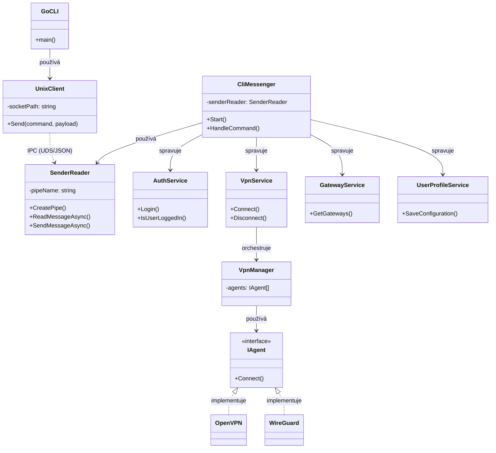

### Komponentový model (User vs System Space)
Vizualizace rozdělení aplikace na klientskou část (User Space) a systémového démona (System Space).

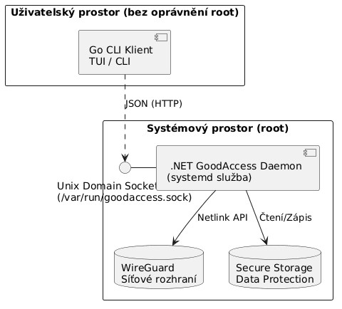

### Bezpečnostní model (Data Protection)
Schéma zajištění bezpečnosti uložených dat a ověřování identity uživatele (LinuxId validation).

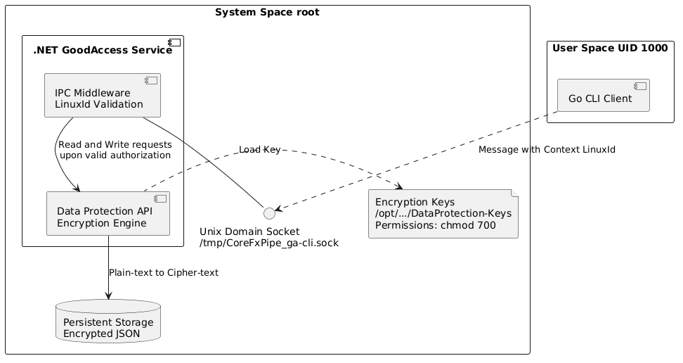

### IPC Komunikace (Sekvenční diagram přihlášení)
Komunikace mezi klientem a službou probíhá asynchronně pomocí JSON zpráv. Níže je vizualizace procesu přihlášení.


### Hierarchie příkazů
Přehled dostupných příkazů a jejich struktury v rámci CLI aplikace.

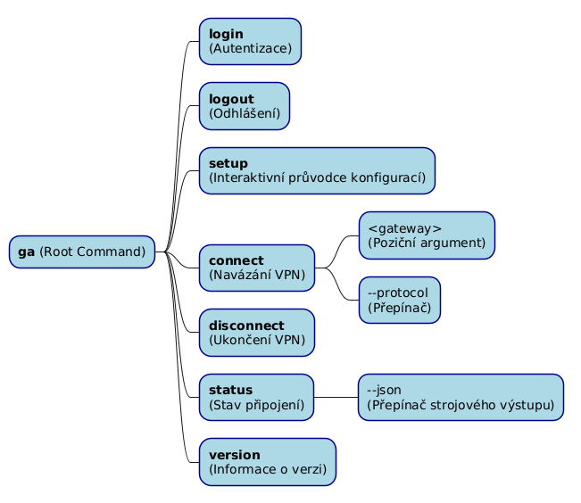

### Distribuce a Aktualizace
Diagram zobrazující proces detekce nové verze a následnou aktualizaci balíčků přes systémového správce balíčků.

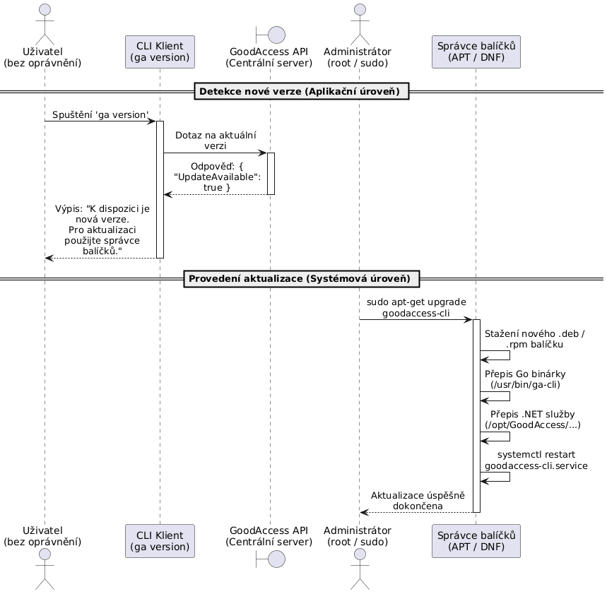

## 📸 Ukázky z Implementace (Screenshots)

Zde jsou snímky obrazovky zachycující různé stavy aplikace v logickém pořadí.

| Stav | Náhled |
| :--- | :--- |
| **Průvodce: Přihlášení (Setup)** | 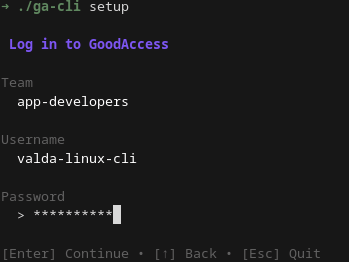 |
| **Průvodce: Výběr brány (Gateway)** | 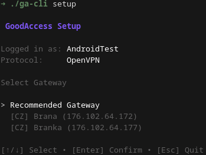 |
| **Průvodce: Protokol** | 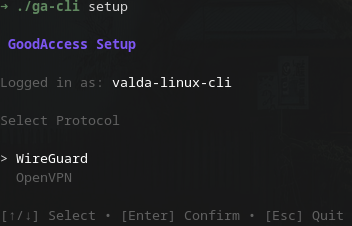 |
| **Průvodce: Persistence** | 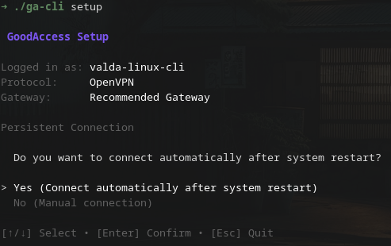 |
| **Úspěšné přihlášení (Login)** | 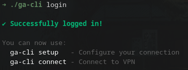 |
| **Připojování (Spinner)** | 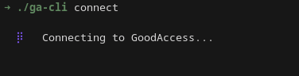 |
| **Stav připojení (Status)** | 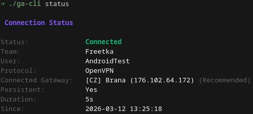 |
| **Úspěšné připojení** | 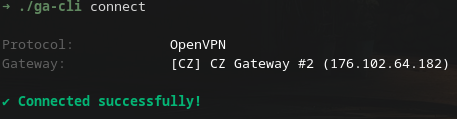 |
| **Odpojeno (Disconnected)** | 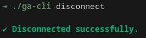 |
| **Nápověda (Help)** | 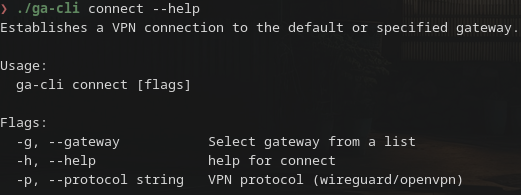 |
| **Chyba sítě (Error)** | 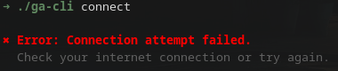 |
| **JSON výstup (Status JSON)** | 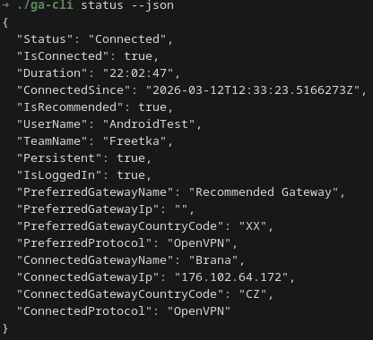 |
| **Konflikt: Jiný uživatel** | 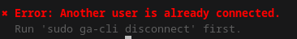 |
| **Odhlášení (Vynucené odpojení)** | 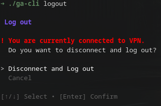 |
| **Úspěšné odhlášení (Logout)** | 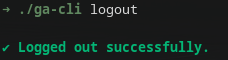 |

---

## 💻 Technické Detaily

### Implementační technologie
- **Frontend (UI/CLI):** [Go (Golang)](./doc/code/main.go) – Zaměřeno na rychlost, jednoduchost a statickou binárku.
- **Backend (Daemon):** [.NET 8 (C#)](./doc/code/Program.cs) – Systémová služba spravovaná přes `systemd`, využívající silné typování a moderní asynchronní API.
- **IPC:** Unix Domain Sockets s JSON serializací (viz [protocol.go](./doc/code/protocol.go)).

### Ukázka kódu (Go Frontend)
```go
// Inicializace klienta a spuštění root příkazu
func main() {
    socketPath := "/tmp/CoreFxPipe_ga-cli.sock"
    client := adapter.NewUnixClient(socketPath)
    rootCmd := cmd.NewRootCmd(client)

    if err := rootCmd.Execute(); err != nil {
        fmt.Fprintln(os.Stderr, err)
        os.Exit(1)
    }
}
```

### Ukázka kódu (C# Backend)
```csharp
// Konfigurace hostitele pro systémovou službu
IHost host = Host.CreateDefaultBuilder(args)
    .UseSystemd()
    .ConfigureServices(services =>
    {
        services.AddDataProtection()
            .PersistKeysToFileSystem(new DirectoryInfo(keysPath))
            .SetApplicationName("CLIService");

        services.AddSingleton(logger);
        services.AddHostedService<Worker>();
    })
    .Build();

await host.RunAsync();
```

---

## 🧪 Zajištění Kvality (QA)

Projekt využívá metodiku **BDD (Behavior-Driven Development)** pro definici uživatelských požadavků a jejich následné testování.

### Gherkin Specifikace
Testovací scénáře jsou psány v jazyce Gherkin, což umožňuje snadnou komunikaci mezi vývojáři a zadavatelem.

**Ukázka scénáře ([connect.feature](./doc/specs/connect.feature)):**
```gherkin
Scenario: Connect using saved preferences (Default behavior)
    Given I have a saved configuration:
      | Gateway  | CZ Prague |
      | Protocol | WireGuard |
    When I run "ga-cli connect"
    Then the system should initiate connection to "CZ Prague" using "WireGuard"
    And I should see "Connected" in the output
    And the exit code should be 0
```

**Odkazy na specifikace:**
- [Login](./doc/specs/login.feature)
- [Logout](./doc/specs/logout.feature)
- [Setup](./doc/specs/setup.feature)
- [Connect](./doc/specs/connect.feature)
- [Disconnect](./doc/specs/disconnect.feature)
- [Status](./doc/specs/status.feature)
- [Version](./doc/specs/version.feature)

---

## 📅 Roadmapa Projektu (Ganttův diagram)

Vývoj probíhal iterativně od počátečního návrhu IPC až po finální balíčkování.

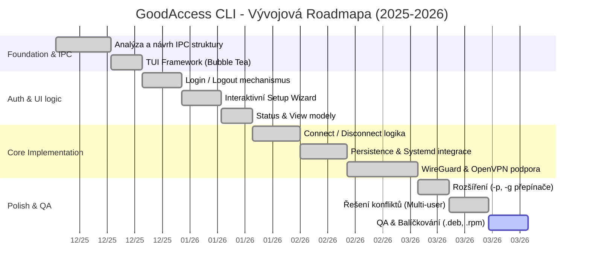

---

## 🎥 Video Ukázka (Walkthrough)

Zde je kompletní video ukázka základního workflow aplikace od prvního nastavení až po odhlášení.


---

## 📄 Dokumentace a Výstupy

Kompletní dokumentaci k projektu naleznete v následujících souborech:

- **Bakalářská práce:** [thesis.pdf](./thesis/build/thesis.pdf)
- **Zdrojové texty (LaTeX):** [thesis/](./thesis/)
- **Prezentace:** [prezentace.pdf](./presentations/SKKI1/build/prezentace.pdf)

---

© 2026 Valdemar Pospíšil
